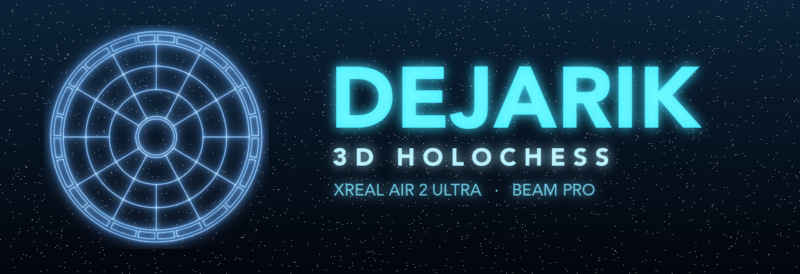

<div align="center">



<br>

**Walk around a holographic creature-combat board, anchored in your room, and play the**
***Star Wars*** **board game in true 3D — or in your browser if you don't have the glasses.**

<br>

[](https://dejarik.vercel.app/play?mode=bot)
[](https://github.com/cifyr/DejarikXR/releases/latest)
[](https://github.com/cifyr/DejarikXR)


</div>

> ◈ **No headset?** The [browser version](https://dejarik.vercel.app/play?mode=bot) runs the
> identical ruleset against the bot — same engine, no VR required.

---

## ⬡ What it is

A 3D, room-scale **Dejarik** (Holochess) for **XREAL Air 2 Ultra** glasses driven by a **Beam Pro**.
Animated creatures stand on a board world-anchored in your physical space; walk around it and view
the match from any angle in 6DoF, pick your pieces with hand tracking, and command the board from a
holographic control deck on the phone.

| | |
|---|---|
| **Hardware** | XREAL Air 2 Ultra (onboard 6DoF SLAM) + Beam Pro (Snapdragon 6 Gen 1 / Adreno 710) |
| **Engine** | Unity 6 LTS · IL2CPP · ARM64 · OpenGL ES3 · min API 29 |
| **XR** | XREAL SDK 3.1.0 · AR Foundation 6 · Unity XR Hands · XR Interaction Toolkit |
| **Models** | glTF 2.0 `.glb` creatures, runtime-loaded via glTFast, custom hologram shader |
| **Mode** | Single-player vs. AI · offline-first · no network required |

The full rules are a faithful, test-covered port of the web version's deterministic engine.

---

## ⬡ How to play

You are **Player 0 — cyan / blue**. The opponent is **Player 1 — amber / red**.

### ▸ Controls

- **Select a piece** — reach out and **touch a piece** with your fingertip (hand tracking). A
  reticle marks the cell nearest your finger so you can aim.
- **Move / attack** — with a piece selected, the legal squares light up. Touch a glowing square to
  move there, or touch an adjacent enemy to attack. Mis-touches never drop your selection.
- **Phone control deck** (Beam Pro touchscreen):
  - **RECENTER** — re-place the board in front of where you're looking.
  - **MOVE** *(hold + tilt)* — hold and tilt the phone like a wand to nudge the board in X/Y/Z.
  - **NEW GAME** — reset the match.
  - A live **2D minimap** mirrors the board so a spectator on the phone can follow along.

### ▸ Rules

Dejarik follows the *Holochess* rules by Mike Kelly.

- **Board** — a disc of **25 spaces**: a center hub, a 12-space inner ring, and a 12-space outer
  ring. Center links to every inner space; each ring space links to its orbit neighbours and its
  same-ray partner in the other ring.
- **Pieces** — each side fields 4 of 8 creatures, each with **Attack / Defense / Movement**:

  | ◇ Creature | ATK | DEF | MOV |
  |---|:--:|:--:|:--:|
  | Mantellian Savrip | 6 | 6 | 2 |
  | Monnok | 6 | 5 | 3 |
  | Ghhhk | 4 | 3 | 2 |
  | Houjix | 4 | 4 | 1 |
  | Kintan Strider | 2 | 7 | 3 |
  | Ng'ok | 3 | 8 | 1 |
  | K'lor'slug | 7 | 3 | 2 |
  | Molator | 8 | 2 | 2 |

- **Turn** — 2 actions per turn; each is a move or an attack (mix freely).
- **Movement (exact-N)** — a piece moves **exactly** its Movement value through empty cells, never
  revisiting one — so it walks *around* other creatures. (A Movement-3 piece can't stop on an
  adjacent cell; it must spend all 3 steps.)
- **Combat** — attacker rolls *Attack* d6, defender rolls *Defense* d6 · `diff = attack − defense`:

  | Roll difference | Outcome |
  |---|---|
  | `diff ≥ 7` | **kill** — defender destroyed |
  | `1 … 6` | **push** — attacker shoves the defender to an open neighbour |
  | `−6 … 0` | **counter-push** — defender shoves the attacker |
  | `diff ≤ −7` | **counter-kill** — attacker destroyed |

- **Winning** — eliminate all enemy pieces. When one piece remains per side, a final **duel**
  decides it. A start-of-turn position repeated three times is a **draw**.

---

## ⬡ Install (sideload)

The app isn't on any store — sideload the release APK onto the Beam Pro over `adb`:

```bash
# grab DejarikXR-<version>-release.apk from the Releases page
adb install -r DejarikXR-1.0-release.apk
# then launch "Dejarik XR" from the Beam Pro launcher, glasses connected
```

Requires an XREAL Beam Pro (or compatible nebulaOS device) with an Air 2 Ultra attached.

---

## ⬡ Build from source

Prerequisites: **Unity 6000.0 LTS** with Android Build Support (IL2CPP), the **XREAL SDK 3.1.0**,
and `adb`.

```bash
# one-time: configure Android player settings (IL2CPP, ARM64, GLES3, minSdk 29)
Unity -batchmode -nographics -projectPath unity \
  -executeMethod XrealAR.EditorTools.XrealBuild.ConfigurePlayerSettings -quit -logFile -

# development build (debug-signed, for iterating on-device)
scripts/build-apk.sh                       # -> unity/build/DejarikXR.apk
scripts/install-apk.sh unity/build/DejarikXR.apk
scripts/logcat.sh                          # tail filtered device logs
```

### ▸ Release-signed build

Signing comes from environment variables, so secrets never touch the committed project settings:

```bash
export DEJARIK_KS_PATH=~/.dejarik-signing/dejarik-release.keystore \
       DEJARIK_KS_PASS=<store-pass> DEJARIK_KEY_ALIAS=dejarik DEJARIK_KEY_PASS=<key-pass> \
       DEJARIK_VERSION=1.0 DEJARIK_VERSION_CODE=1 \
       DEJARIK_OUT=build/DejarikXR-1.0-release.apk

Unity -batchmode -nographics -buildTarget Android -projectPath unity \
  -executeMethod XrealAR.EditorTools.XrealBuild.BuildReleaseApk -quit -logFile -
```

### ▸ Tests

The pure rules engine (`unity/Assets/Scripts/Game/`) is engine-independent and covered by EditMode
tests in the Unity Test Framework.

---

## ⬡ Project structure

```
unity/Assets/Scripts/Game/             pure, deterministic rules engine (no Unity refs) + tests
unity/Assets/Scripts/View/             board, creatures, hand input, audio, HUD, phone deck
unity/Assets/Shaders/                  Dejarik/Hologram shader
unity/Assets/StreamingAssets/Models/   board.glb + per-creature .glb (runtime-loaded)
unity/Assets/Editor/                   headless build + offline screenshot harness
scripts/                               adb / device workflow helpers
```

---

<div align="center">

⬡ ⬡ ⬡

**Dejarik / Holochess is from _Star Wars_ (Lucasfilm). A non-commercial fan project.**
Ruleset after the *Holochess* rules by Mike Kelly · built with Unity, the XREAL SDK & glTFast.

</div>
